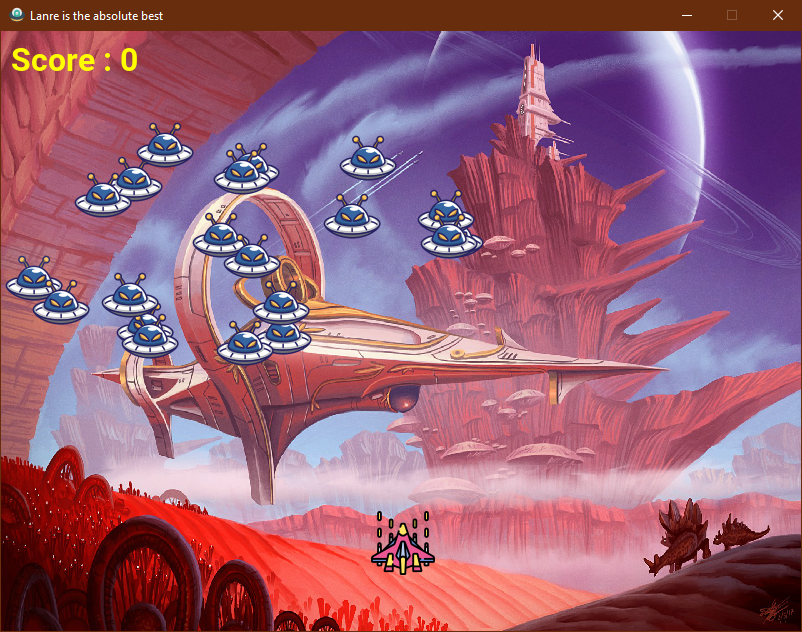

<h1></h1>
<h1>My Space invaders Game</h1>

Entirely built with Pygame
  <ol>
    <li>Still in Alpha development</li>
    <li>Enemies not dying when the game is over</li>
    <li>Issue with the collisions particularly when the enemies hit the tip of the spaceship</li>
    </ol>
 

